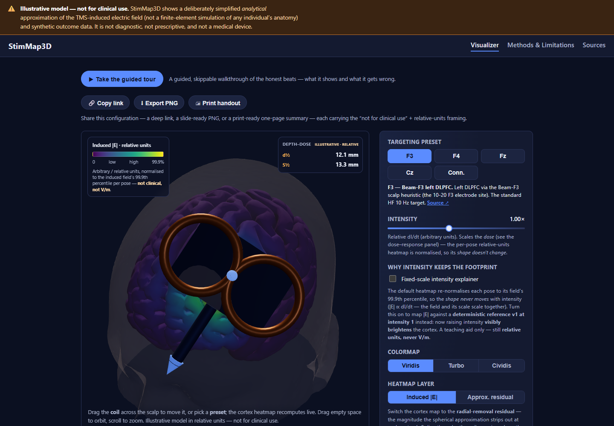

# StimMap3D

An educational 3D visualizer for rTMS coil targeting, induced electric fields and published protocol comparisons. By [Paige Rattenberry](https://github.com/PaigeRattenberry).

**Illustrative model — not for clinical use.** Fields use relative units; individual outcome trajectories are synthetic. The spherical approximation is not anatomically faithful FEM or a prediction of treatment response.



Choose a targeting preset, move or rotate the figure-8 coil, then compare the field footprint and cited analytics. The guided tour explains the controls. Methods describes the approximation; Sources lists scientific references and licenses. PNG export and a printable summary retain the non-clinical context.

## Run locally

Use Node 24 (see .nvmrc).

```sh
npm ci
npm run dev
```

For production output: `npm run build`, then `npm run preview`. The static artifact is `web/dist`. A hosted demo URL has not been configured.

## Engineering and validation

React/TypeScript, React Three Fiber, Zustand and a browser worker form a static application with no server runtime. Python and Node generators run only during asset authoring.

- [Architecture and scientific boundaries](DESIGN.md)
- [Three engineering decisions with executable evidence](docs/engineering-decisions.md)
- [AI-assisted workflow and review briefs](docs/agentic-development.md)
- [Validation results](docs/validation.md)
- [Contribution and validation commands](CONTRIBUTING.md)
- [Release configuration](docs/release-controls.md)
- [Asset reproducibility](tooling/README.md)

## Credits

Code is [MIT licensed](LICENSE). Meshes, templates and dependencies retain their own terms: see [NOTICE.md](NOTICE.md), the [citation ledger](web/src/data/citations.json), in-app Sources page and generated THIRD_PARTY_NOTICES.txt. Scientific attribution does not imply institutional affiliation or endorsement.
